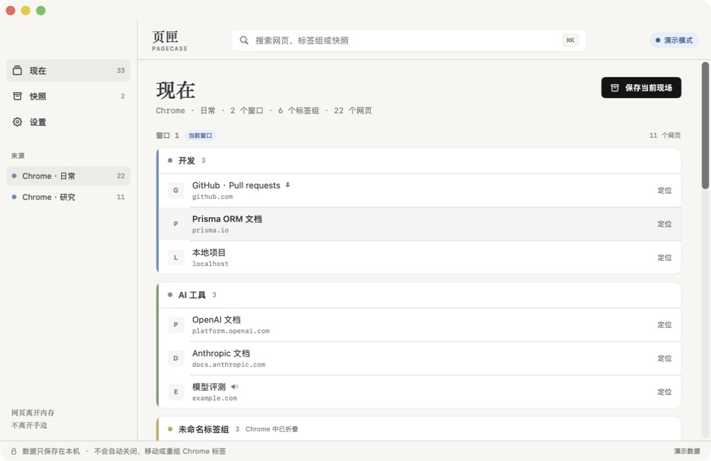
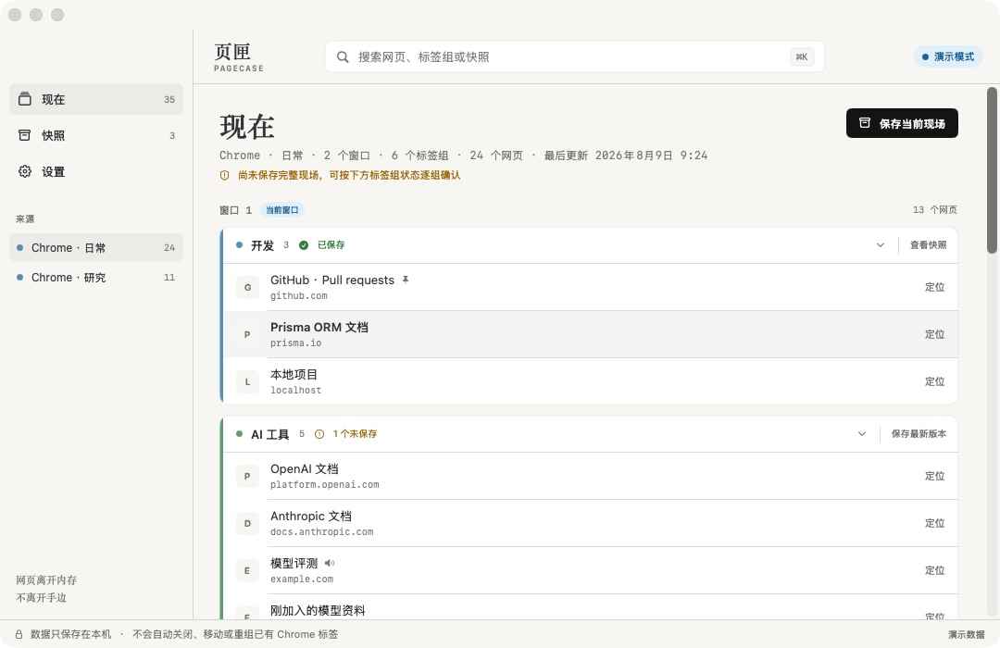
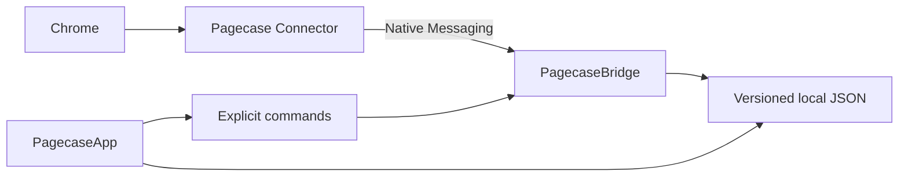

<div align="center">


# 页匣 · Pagecase

网页离开内存，不离开手边。

[核心能力](#-核心能力) · [开始使用](#-构建与连接) · [安全边界](#-安全边界) · [项目文档](#-文档)

</div>

<div align="center">

[中文](README.md) | [English](README_EN.md)

</div>

<div align="center">


</div>

> [!TIP]
> 页匣是一款为低内存 Mac 设计的本地网页资料库。它保留 Chrome 原有的窗口、标签组、网页顺序和重复网址，让你在确认快照安全后自行关闭不常用页面，需要时再搜索单页或恢复完整分组。



---

## ✨ 核心能力

- **实时镜像 Chrome** — 展示普通窗口、原生标签组、未分组网页和原有顺序，不读取网页正文。
- **按现场或分组保存** — 可以保存完整 Chrome 现场，也可以只保存一个标签组；两者写入后都不会被后续变化改写。
- **判断是否放心关闭** — 实时显示完整现场和每个标签组的保存覆盖状态，新增网页会标出未保存数量。
- **快速找回网页与分组** — 搜索标题、域名、完整网址、标签组和快照名称；标签组作为独立结果，可直接查看或从快照确认恢复。
- **按需恢复** — 定位仍在 Chrome 中的网页、从快照打开单页，或按原顺序恢复完整标签组。
- **保留整理语境** — 保存窗口、组名、颜色、顺序和重复网址，不把不同语境中的相同网址强行去重。
- **本地资料管理** — 支持快照重命名、带确认的删除，以及版本化 JSON 资料库导入与导出。
- **原生且轻量** — 使用 SwiftUI、AppKit 与极小的 Manifest V3 连接器，不使用 Electron、WebView、数据库或云服务。

---

## 🚀 核心流程

页匣解决的是“关闭后还能不能找回来”，不会替你自动清理 Chrome：

1. 在“现在”页面保存完整现场，或直接保存准备关闭的标签组。
2. 回到 Chrome，由你自己关闭暂时不用的页面或标签组，释放内存。
3. 以后通过搜索打开一个网页，或从快照恢复整个标签组。

恢复整组前，页匣会显示组名和即将打开的网页数量。连接器只组合本次恢复命令新建的标签，不会把任何已有标签加入新组。

---

## 📦 构建与连接

### 系统要求

- macOS 14 或更高版本
- Google Chrome
- Swift 6 与 Apple Command Line Tools
- Node.js 22，仅在运行扩展测试时需要

### 从源码构建

```bash
git clone https://github.com/zaynzhu/Pagecase.git
cd Pagecase
./scripts/build-app.sh
open "dist/页匣.app"
```

构建脚本会生成经过 ad-hoc 签名的 `dist/页匣.app`，并把 Chrome 连接器与 `PagecaseBridge` 一同打包。

### 首次连接 Chrome

1. 打开页匣的“设置”，点击“显示扩展文件”。
2. 在 Chrome 地址栏打开 `chrome://extensions`，启用“开发者模式”。
3. 点击“加载已解压的扩展程序”，选择页匣刚显示的文件夹。
4. 复制 Chrome 显示的 32 位扩展标识，粘贴回页匣。
5. 点击“配置本地连接”，等待“已连接”状态出现。

页匣不会替你打开扩展管理页，也不会自动安装扩展。需要排查时，可查看连接器文件夹中的 `README.txt`。

---

## 💡 使用方式

### 保存当前现场

进入“现在”，选择 Chrome 来源并点击“保存当前现场”。快照会完整复制当时的窗口和分组结构，保存成功后显示网页数、标签组数和覆盖状态。

### 单独保存一个标签组

每个标签组会显示自己的保存状态：

- “保存该组”只复制当前标签组，不保存其他窗口或网页。
- 组内新增网页后显示未保存数量，并提供“保存最新版本”。旧版本继续保留，不会被覆盖。
- 已完整保存的标签组提供“查看快照”，直接打开对应版本和标签组。

标签组快照保留组名、颜色、网页顺序和重复网址。完整现场状态只由完整现场快照判断，避免把一份标签组快照误认为整个 Chrome 已经保存。



### 搜索并找回网页或标签组

按 `⌘K` 输入标题、域名、网址、标签组或快照名称：

- 实时结果使用“定位”，只聚焦已经打开的标签。
- 快照结果使用“打开”，只新建一个标签。
- 标签组结果使用“查看”，只在页匣内打开并展开对应位置；快照标签组另有“恢复整组”，确认网页数量后才会创建标签。
- Return 对标签组执行“查看”，不会直接恢复整组。
- 来源离线或数据过期时，相关动作会禁用，但本地快照仍可浏览和搜索。

### 恢复或删除快照内容

- 在快照标签组标题右侧点击“恢复整组”，确认后按原顺序创建并组合新标签。
- 在快照详情标题旁点击“删除快照”，确认名称和网页数量后才会删除对应的本地文件。
- 删除快照无法撤销，但不会关闭或改变 Chrome 中的任何页面。

---

## 🔒 安全边界

> [!IMPORTANT]
> 页匣不会自动关闭、移动、挂起、解除分组或重新分组任何已有 Chrome 标签。真正释放内存的关闭操作始终由用户本人完成。

页匣明确不做以下事情：

- 不读取网页正文、截图、浏览历史、书签、下载记录或无痕窗口。
- 不处理 `file://`、`chrome://`、扩展页或其他非 Web 协议。
- 不登录、不联网、不上传遥测，也不提供账号、云同步或团队协作。
- 不使用 Chrome 标签关闭、移动、挂起或解除分组 API。
- 不自动恢复窗口，不修改任何已有标签组。

所有会改变 Chrome 可见状态的操作都来自用户单次点击；恢复整组还需要额外确认网页数量。详细边界见 [产品设计](docs/PRODUCT.md) 与 [架构决策](docs/adr/0002-restore-groups-with-new-tabs-only.md)。

---

## 技术架构



| 组件 | 职责 |
|---|---|
| `PagecaseApp` | SwiftUI/AppKit 原生界面、搜索、快照、设置与菜单栏入口 |
| `PagecaseCore` | 数据模型、校验、原子 JSON 存储、覆盖判断与命令模型 |
| `PagecaseBridge` | Chrome Native Messaging 协议、实时现场落盘与命令转发 |
| `extension/` | 查询普通 Chrome 窗口和标签组，执行严格白名单命令 |

应用运行时没有第三方依赖，也不启动本地 HTTP 服务。

---

## 本地数据

正式模式的数据默认保存在：

```text
~/Library/Application Support/Pagecase/
├── live/
├── snapshots/
├── preferences.json
└── ChromeExtension/
```

快照和导出文件包含完整网址，其中可能带有敏感查询参数。备份或分享 JSON 前，请将其按浏览数据妥善保管。

---

## 🧪 开发与验证

使用隔离演示数据启动应用，不连接真实 Chrome：

```bash
PAGECASE_DEMO=1 \
PAGECASE_DATA_ROOT="$(mktemp -d)/pagecase" \
"dist/页匣.app/Contents/MacOS/PagecaseApp" --demo
```

运行完整自动化检查：

```bash
swift build
swift test --enable-swift-testing --disable-xctest
swift run PagecaseCoreChecks
npm run check:extension
npm run test:extension
npm run test:bridge
./scripts/validate-extension.sh
./scripts/build-app.sh
```

当前 0.4.0 版本已通过 59 项 Swift 核心行为检查、10 项扩展测试、Bridge 协议往返、扩展危险 API 扫描、Release 构建、视觉验收和 500 页性能验收。

> [!NOTE]
> 仅安装 Command Line Tools 的环境无法正常枚举 Swift Testing 测试；`swift test` 仍负责编译测试包，`PagecaseCoreChecks` 会实际执行同一组关键行为检查。

---

## 📚 文档

| 文档 | 内容 |
|---|---|
| [产品设计](docs/PRODUCT.md) | 产品目标、范围、关键流程与失败场景 |
| [技术架构](docs/ARCHITECTURE.md) | 组件边界、数据协议、存储和安全约束 |
| [视觉设计](docs/VISUAL-DESIGN.md) | 原生 macOS 界面规范与交互细节 |
| [验证计划](docs/VALIDATION.md) | 自动化、静态安全、视觉与性能验收要求 |
| [验证结果](docs/VALIDATION-RESULTS.md) | 当前版本的完整验收记录与未验证项 |
| [ADR 0001](docs/adr/0001-native-app-with-read-only-chrome-bridge.md) | 原生应用与 Chrome 桥接架构决策 |
| [ADR 0002](docs/adr/0002-restore-groups-with-new-tabs-only.md) | 只用新建标签恢复完整分组的安全决策 |

---

## 🤝 参与开发

项目遵循小步、原子提交和可验证改动。提交前请至少运行与变更相关的 Swift 或 Node 测试；如果修改扩展命令，还必须运行 `./scripts/validate-extension.sh`。

```bash
git clone https://github.com/zaynzhu/Pagecase.git
cd Pagecase
swift build
swift run PagecaseCoreChecks
npm run test:extension
```

提交信息使用 `type: 中文描述` 格式，例如 `feat: 添加快照筛选` 或 `fix: 修复来源状态判断`。
