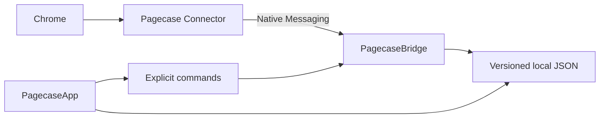

<div align="center">


# Pagecase

Let pages leave memory, not your reach.

[Features](#-features) · [Get Started](#-build-and-connect) · [Safety](#-safety-boundaries) · [Documentation](#-documentation)

</div>

<div align="center">

[中文](README.md) | [English](README_EN.md)

</div>

<div align="center">


</div>

> [!TIP]
> Pagecase is a local web library designed for low-memory Macs. It preserves the windows, tab groups, page order, and duplicate URLs already organized in Chrome, so you can close inactive pages yourself after confirming a snapshot and later search for one page or restore a complete group.


---

## ✨ Features

- **Live Chrome mirror** — Shows regular windows, native tab groups, ungrouped pages, and their original order without reading page content.
- **Full-state or group snapshots** — Save the complete Chrome state or one tab group; neither is overwritten by later Chrome changes.
- **Safe-to-close status** — Shows snapshot coverage for the complete live state and each tab group, including the number of newly unsaved pages.
- **Fast page and group retrieval** — Searches titles, domains, full URLs, tab groups, and snapshot names; groups appear as first-class results that can be viewed or explicitly restored from snapshots.
- **Restore on demand** — Focuses a page still open in Chrome, opens one page from a snapshot, or restores a complete tab group in order.
- **Preserved context** — Keeps windows, group names, colors, order, and duplicate URLs instead of merging identical URLs from different contexts.
- **Local library management** — Supports snapshot renaming, confirmed deletion, and versioned JSON library import and export.
- **Native and lightweight** — Uses SwiftUI, AppKit, and a tiny Manifest V3 connector without Electron, WebView, a database, or cloud services.

---

## 🚀 Core Workflow

Pagecase solves the fear of losing pages after closing them. It does not clean up Chrome automatically:

1. In “Live,” save the complete state or just the tab group you plan to close.
2. Return to Chrome and close inactive pages or groups yourself to release memory.
3. Later, search for one page or restore a complete tab group from a snapshot.

Before restoring a group, Pagecase shows its name and the number of pages that will open. The connector groups only the tabs created by that restore command and never adds an existing tab to the new group.

---

## 📦 Build and Connect

### Requirements

- macOS 14 or later
- Google Chrome
- Swift 6 and Apple Command Line Tools
- Node.js 22, required only for extension tests

### Build from source

```bash
git clone https://github.com/zaynzhu/Pagecase.git
cd Pagecase
./scripts/build-app.sh
open "dist/页匣.app"
```

The build script creates an ad-hoc signed `dist/页匣.app` and bundles both the Chrome connector and `PagecaseBridge`.

### Connect Chrome for the first time

1. Open Pagecase Settings and choose “显示扩展文件” (Show Extension Files).
2. Open `chrome://extensions` in Chrome and enable Developer Mode.
3. Choose “Load unpacked” and select the folder revealed by Pagecase.
4. Copy the 32-character extension ID shown by Chrome and paste it into Pagecase.
5. Choose “配置本地连接” (Configure Local Connection) and wait for the connected status.

Pagecase does not open the extension management page or install the extension automatically. For troubleshooting, read `README.txt` in the connector folder.

---

## 💡 Usage

### Save the current state

Open “Live,” select a Chrome source, and choose “保存当前现场” (Save Current State). The snapshot copies the complete window and group structure, then reports the saved page count, group count, and coverage status after persistence succeeds.

### Save one tab group

Each tab group shows its own saved state:

- “保存该组” (Save This Group) copies only that group, not other windows or pages.
- After a page is added, the group shows the unsaved count and offers “保存最新版本” (Save Latest Version). Earlier versions remain unchanged.
- A fully saved group offers “查看快照” (View Snapshot), which opens the exact saved version and group.

A group snapshot preserves the group name, color, page order, and duplicate URLs. Complete-state coverage is evaluated only against full-state snapshots, so one saved group is never presented as proof that all of Chrome has been saved.


### Search for and retrieve a page or group

Press `⌘K` and search by title, domain, URL, tab group, or snapshot name:

- A live result uses Focus and only activates an already open tab.
- A snapshot result uses Open and creates only one new tab.
- A group result uses View and only navigates inside Pagecase. Snapshot groups expose a separate Restore Group action that confirms the page count before creating tabs.
- Return on a group performs View and never restores the group directly.
- When a source is offline or stale, its actions are disabled while local snapshots remain searchable and readable.

### Restore a group or delete a snapshot

- Choose “恢复整组” (Restore Group) beside a snapshot group and confirm to create and group new tabs in their original order.
- Choose “删除快照” (Delete Snapshot) beside the snapshot title; the matching local file is removed only after confirming its name and page count.
- Snapshot deletion cannot be undone, but it never closes or changes a page in Chrome.

---

## 🔒 Safety Boundaries

> [!IMPORTANT]
> Pagecase never closes, moves, discards, ungroups, or regroups any existing Chrome tab automatically. The user always performs the closing action that releases memory.

Pagecase explicitly does not:

- Read page content, screenshots, browsing history, bookmarks, downloads, or incognito windows.
- Process `file://`, `chrome://`, extension pages, or other non-Web protocols.
- Sign in, access the network, upload telemetry, or provide accounts, cloud sync, or team collaboration.
- Use Chrome APIs that close, move, discard, or ungroup tabs.
- Restore complete windows or modify an existing tab group.

Every action that changes visible Chrome state starts with a single user click, and group restoration additionally confirms the page count. See the [product specification](docs/PRODUCT.md) and [restore-group architecture decision](docs/adr/0002-restore-groups-with-new-tabs-only.md) for the complete boundary.

---

## Architecture



| Component | Responsibility |
|---|---|
| `PagecaseApp` | Native SwiftUI/AppKit interface, search, snapshots, settings, and menu bar entry |
| `PagecaseCore` | Data models, validation, atomic JSON storage, coverage evaluation, and command models |
| `PagecaseBridge` | Chrome Native Messaging protocol, live-state persistence, and command forwarding |
| `extension/` | Queries regular Chrome windows and tab groups and executes strictly allowlisted commands |

The running app has no third-party dependency and starts no local HTTP service.

---

## Local Data

Production data is stored by default in:

```text
~/Library/Application Support/Pagecase/
├── live/
├── snapshots/
├── preferences.json
└── ChromeExtension/
```

Snapshots and exported files contain full URLs that may include sensitive query parameters. Treat copied or shared JSON files as browsing data.

---

## 🧪 Development and Validation

Start the app with isolated demo data and no real Chrome connection:

```bash
PAGECASE_DEMO=1 \
PAGECASE_DATA_ROOT="$(mktemp -d)/pagecase" \
"dist/页匣.app/Contents/MacOS/PagecaseApp" --demo
```

Run the complete automated checks:

```bash
swift build
swift test --enable-swift-testing --disable-xctest
swift run PagecaseCoreChecks
npm run check:extension
npm run test:extension
npm run test:bridge
./scripts/validate-extension.sh
./scripts/build-app.sh
```

Pagecase 0.4.0 has passed 59 Swift core behavior checks, 10 extension tests, the Bridge protocol round trip, the dangerous-extension-API scan, Release builds, visual acceptance, and the 500-page performance run.

> [!NOTE]
> A Command Line Tools-only environment cannot enumerate Swift Testing tests correctly. `swift test` still compiles the test package, while `PagecaseCoreChecks` executes the same critical behavior checks.

---

## 📚 Documentation

| Document | Contents |
|---|---|
| [Product specification](docs/PRODUCT.md) | Product goals, scope, critical workflows, and failure scenarios |
| [Technical architecture](docs/ARCHITECTURE.md) | Component boundaries, data protocols, storage, and safety constraints |
| [Visual design](docs/VISUAL-DESIGN.md) | Native macOS interface rules and interaction details |
| [Validation plan](docs/VALIDATION.md) | Automated, static safety, visual, and performance requirements |
| [Validation results](docs/VALIDATION-RESULTS.md) | Current acceptance evidence and remaining unverified items |
| [ADR 0001](docs/adr/0001-native-app-with-read-only-chrome-bridge.md) | Native app and Chrome bridge architecture decision |
| [ADR 0002](docs/adr/0002-restore-groups-with-new-tabs-only.md) | Safety decision to restore groups with newly created tabs only |

---

## 🤝 Contributing

The project favors small, atomic commits and verifiable changes. Before submitting a change, run the relevant Swift or Node tests. Any change to extension commands must also run `./scripts/validate-extension.sh`.

```bash
git clone https://github.com/zaynzhu/Pagecase.git
cd Pagecase
swift build
swift run PagecaseCoreChecks
npm run test:extension
```

Commit messages use the `type: Chinese description` format, for example `feat: 添加快照筛选` or `fix: 修复来源状态判断`.
