<div align="center">


# Pagecase

Let pages leave memory, not your reach.

[Features](#-features) · [Get Started](#-build-and-connect) · [Safety](#-safety-boundaries) · [Documentation](#-documentation)

</div>

<div align="center">

[中文](README.md) | [English](README_EN.md)

</div>

<div align="center">


</div>

> [!TIP]
> Pagecase is a local web library for low-memory Macs. It mirrors Chrome into immutable snapshots and captures the front Safari window into a collection only when requested. Browser sources remain visually and structurally separate while sharing one search entry point.

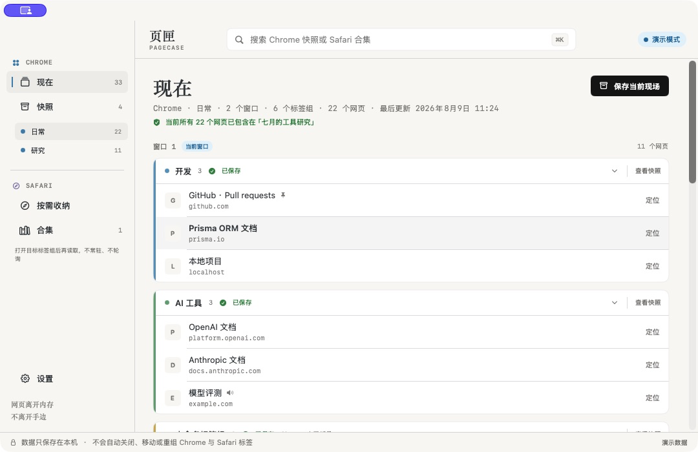

---

## ✨ Features

- **Live Chrome mirror** — Shows regular windows, native tab groups, ungrouped pages, and their original order without reading page content.
- **On-demand Safari capture** — Reads the front Safari window only after a click, previews it, and saves a local collection without a Safari extension, full Xcode, or background monitoring.
- **Explicit browser separation** — Sidebar sections, libraries, counts, icons, and actions distinguish Chrome from Safari; mixed search results still identify their browser.
- **Full-state or group snapshots** — Save the complete Chrome state or one tab group; neither is overwritten by later Chrome changes.
- **Safe-to-close status** — Shows full-state and per-group coverage with an explicit All / Needs Saving / Collected switch.
- **Manual-close checklist** — Lists only fresh Chrome groups that are fully covered by a same-source snapshot, with a final Locate action before you close them yourself.
- **Fast page and group retrieval** — Searches titles, domains, full URLs, tab groups, and snapshot names with an explicit All / Chrome / Safari scope; groups remain first-class results.
- **Restore on demand** — Focuses a page still open in Chrome, opens one page from a snapshot, or restores a complete tab group in order.
- **Preserved context** — Keeps windows, group names, colors, order, and duplicate URLs instead of merging identical URLs from different contexts.
- **Group version series** — Collects repeated saves of the same tab group into one series, prioritizing the latest snapshot while keeping every older version available.
- **Local library management** — Supports confirmed deletion, complete-library backups, browser-scoped exports, and a read-only Chrome / Safari import preview before confirmation.
- **Native and lightweight** — Uses SwiftUI, AppKit, and a tiny Manifest V3 connector without Electron, WebView, a database, or cloud services.

---

## 🚀 Core Workflow

Pagecase solves the fear of losing pages after closing them. It never cleans up a browser automatically.

For Chrome:

1. In “Live,” switch to Needs Saving and save the groups you plan to close, or save the complete state.
2. Return to Chrome and close inactive pages or groups yourself to release memory.
3. Later, search for one page or restore a complete tab group from a snapshot.

Before restoring a group, Pagecase shows the target Chrome source, pages in the snapshot, matching URLs already open, and the number of tabs that will be created. It also warns that memory can rise briefly during restoration. Duplicate URLs are never removed automatically; the connector groups only tabs created by that restore command and never adds an existing tab to the new group. A persistent Chrome-only receipt then distinguishes complete success, partial completion, failure, and timeout. Partial or timed-out restores are never cleaned up or retried automatically.

For Safari:

1. Open the native Safari tab group you want to collect and bring its window to the front.
2. Open “Safari · 按需收纳” in Pagecase, read the current window once, review it, and name the collection.
3. After confirming the collection is searchable and openable, close the original Safari group yourself.

The capture stops immediately after reading. Safari automation does not reliably expose the native tab-group name, so Pagecase asks you to name the local collection.

---

## 📦 Build and Connect

### Requirements

- macOS 14 or later
- Google Chrome; system Safari when using Safari collections
- Swift 6 and Apple Command Line Tools
- Node.js 22, required only for extension tests

### Build from source

```bash
git clone https://github.com/zaynzhu/Pagecase.git
cd Pagecase
./scripts/build-app.sh
open "dist/页匣.app"
```

The build script creates an ad-hoc signed `dist/页匣.app` and bundles both the Chrome connector and `PagecaseBridge`. Building and on-demand Safari capture do not require full Xcode.

### Connect Chrome for the first time

1. Open Pagecase Settings and choose “显示扩展文件” (Show Extension Files).
2. Open `chrome://extensions` in Chrome and enable Developer Mode.
3. Choose “Load unpacked” and select the folder revealed by Pagecase.
4. Copy the 32-character extension ID shown by Chrome and paste it into Pagecase.
5. Choose “配置本地连接” (Configure Local Connection) and wait for the connected status.

Pagecase does not open the extension management page or install the extension automatically. For troubleshooting, read `README.txt` in the connector folder.

---

## 💡 Usage

### Save the current state

Open “Live,” select a Chrome source, and choose “保存当前现场” (Save Current State). The snapshot copies the complete window and group structure, then reports the saved page count, group count, and coverage status after persistence succeeds.

### Save one tab group

Each tab group shows its own saved state:

- “保存该组” (Save This Group) copies only that group, not other windows or pages.
- After a page is added, the group shows the unsaved count and offers “保存最新版本” (Save Latest Version). Earlier versions remain unchanged.
- A fully saved group offers “查看快照” (View Snapshot), which opens the exact saved version and group.

A group snapshot preserves the group name, color, page order, and duplicate URLs. Complete-state coverage is evaluated only against full-state snapshots, so one saved group is never presented as proof that all of Chrome has been saved.


### Filter the next groups to collect

The Live page summarizes collected groups and provides three flat filters:

- All preserves the original window structure and keeps ungrouped pages visible.
- Needs Saving shows only groups that are not fully covered by a local snapshot. A successfully saved group leaves this view immediately.
- Collected shows only groups whose current contents are completely present in a local snapshot, with direct access to that snapshot.

Collected never means that Pagecase may close the group. After verifying the snapshot, you still return to Chrome and close inactive groups yourself. Opening a hidden group from search resets this filter to All before Pagecase reveals the target.

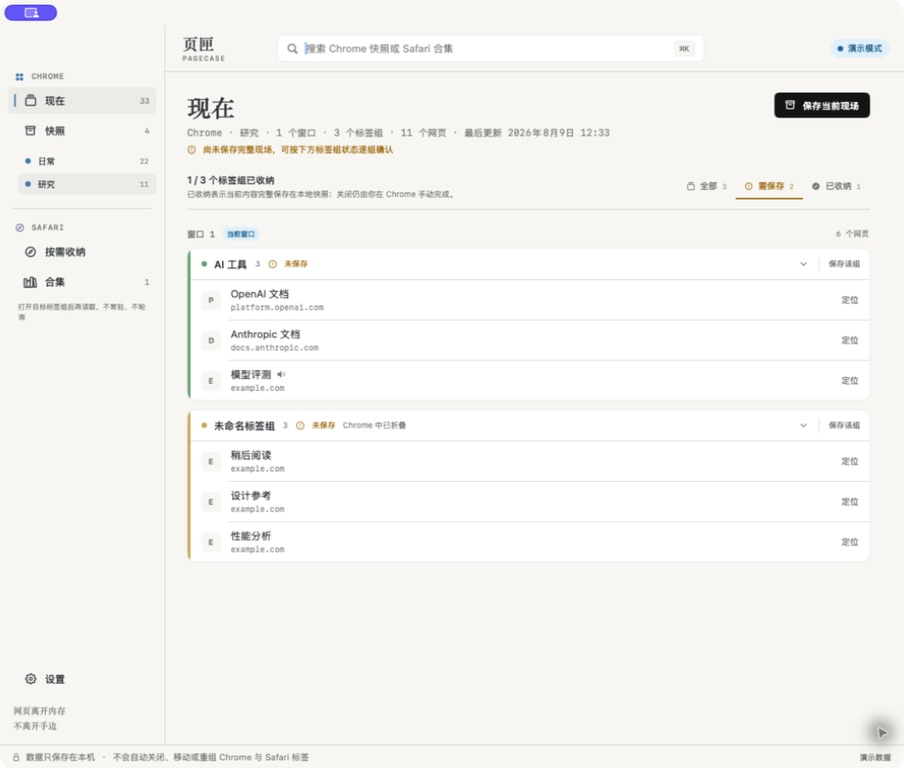

### Verify a Chrome group before closing it

When a Chrome source is still fresh and every page in a non-empty group is fully covered by a local snapshot from that same source, the Live page adds it to the “可以手动关闭” (Can Be Closed Manually) checklist. Each row keeps the window number, group name, page count, matching snapshot, save date, and a Locate action for one final review.

This checklist is guidance, not browser control. Pagecase never closes, moves, discards, or regroups a tab for you. The checklist belongs only to Chrome Live; Safari pages never display it or inherit Chrome presence and closing semantics.

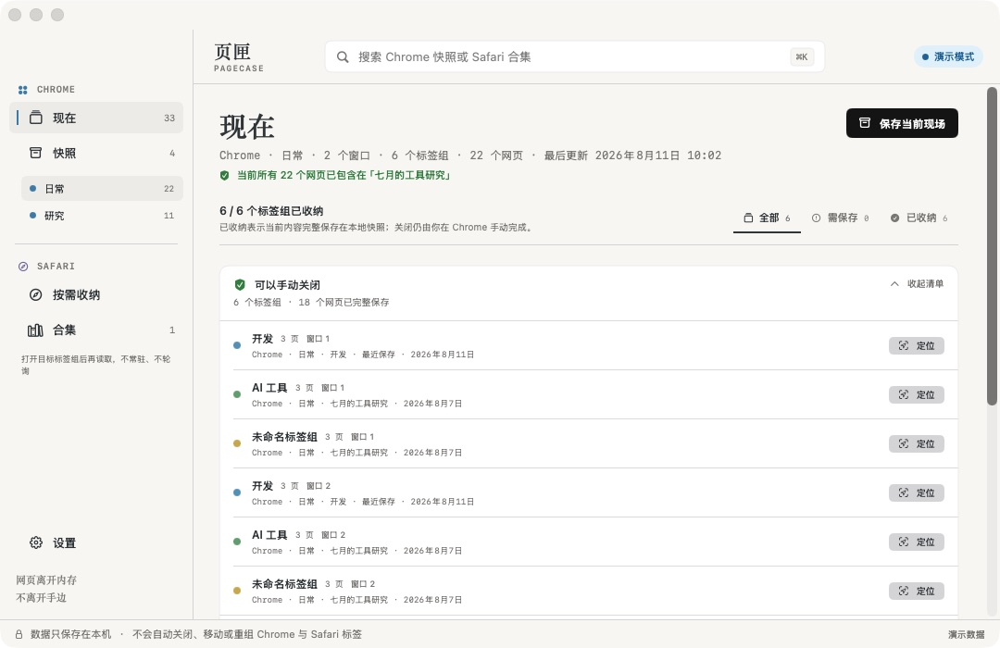
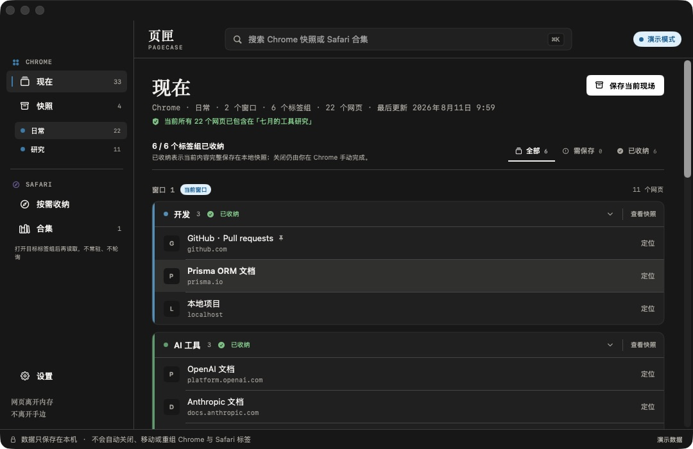

### Browse earlier group versions

After the same Chrome tab group is saved repeatedly, the snapshot sidebar collects those independent snapshots into one version series:

- A series starts collapsed and opens its latest version by default, keeping older saves from crowding the sidebar.
- Its disclosure control reveals earlier versions with their own names, dates, page counts, and complete contents.
- Full-state snapshots always remain standalone. A changed group name or color starts a separate series.
- Renaming or deleting affects only the selected snapshot and never merges, overwrites, or automatically cleans up another version.

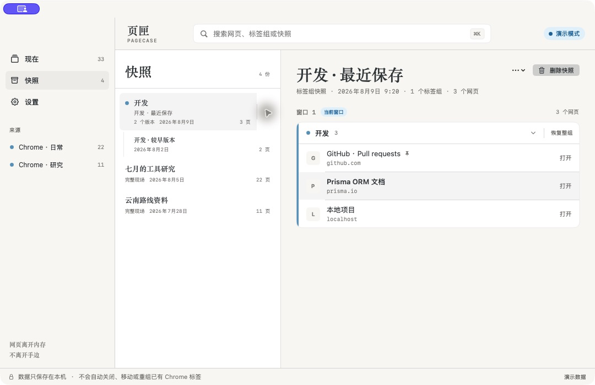

### Confirm what has left Chrome

The Chrome snapshot index includes a compact collection overview for snapshots that have left Chrome, remain partially open, remain fully open, or cannot currently be confirmed. A group restored by Pagecase keeps the exact identifier returned for the newly created Chrome group, so later views can say “已恢复为新组” instead of confusing it with the original group.

This status belongs only to Chrome snapshots. Safari collections have no background live source and never display or contribute to the Chrome overview.

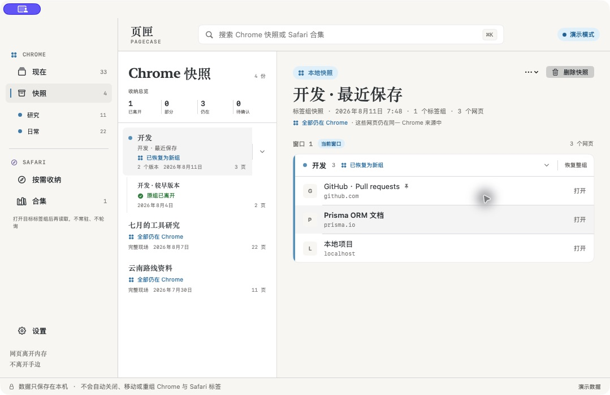

### Collect the current Safari window

1. Switch Safari to the target native tab group or window.
2. Open the Safari section in Pagecase, choose “按需收纳,” then “读取当前窗口.”
3. Review page order, duplicate URLs, the active page, and skipped non-Web pages, then save and name the collection.
4. Browse, delete, open one page, or confirm the page count before opening the complete collection in Safari.

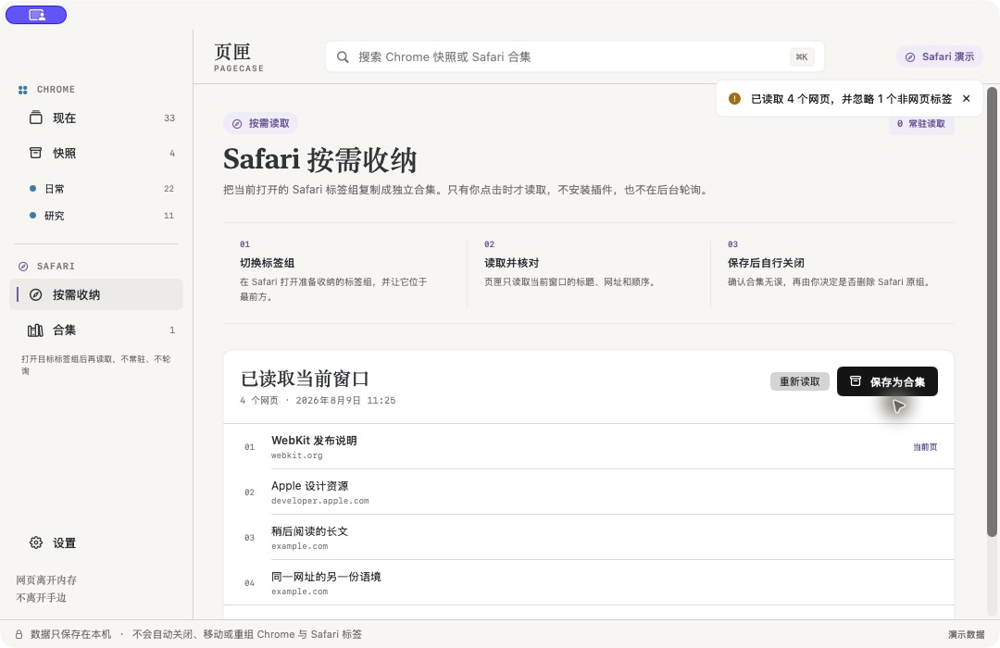

A Safari collection is never presented as a Chrome snapshot and never modifies Safari. macOS may request Automation permission on the first real capture; denying it does not affect Chrome features.

### Search for and retrieve a page or group

Press `⌘K` and search by title, domain, URL, tab group, or snapshot name:

- Switch between All, Chrome, and Safari above the results. The top-bar badge follows the active scope, and a browser-only result set never includes the other browser.
- A live result uses Focus and only activates an already open tab.
- A snapshot result uses Open and creates only one new tab.
- A group result uses View and only navigates inside Pagecase. Snapshot groups expose a separate Restore Group action that opens a Chrome-only preview before creating tabs.
- Return on a group performs View and never restores the group directly.
- When a source is offline or stale, its actions are disabled while local snapshots remain searchable and readable.

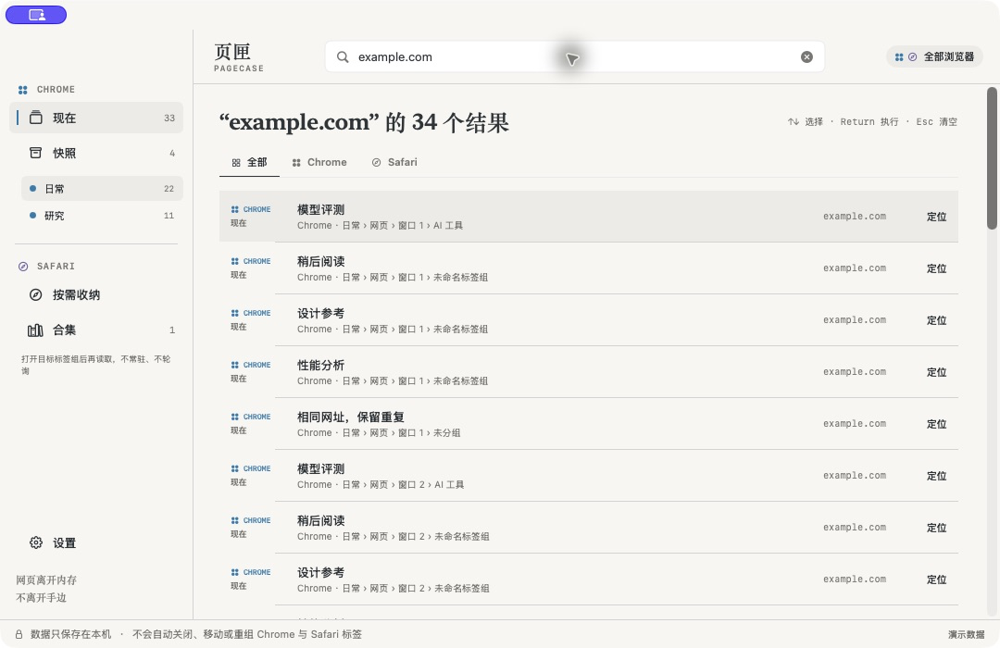

### Restore a group or delete a snapshot

- Choose “恢复整组” (Restore Group) beside a snapshot group, review its source, matching open URLs, new-tab count, and memory note, then create and group the new tabs in their original order.
- The restore receipt reports created versus expected tabs, grouping state, and the failure stage. After a partial result or timeout, inspect Chrome first; Pagecase does not roll back or retry automatically.
- Choose “删除快照” (Delete Snapshot) beside the snapshot title; the matching local file is removed only after confirming its name and page count.
- Snapshot deletion cannot be undone, but it never closes or changes a page in Chrome.

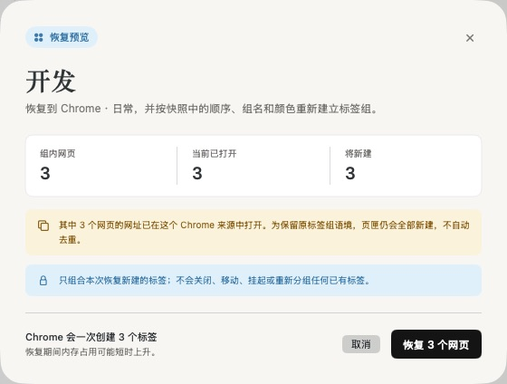

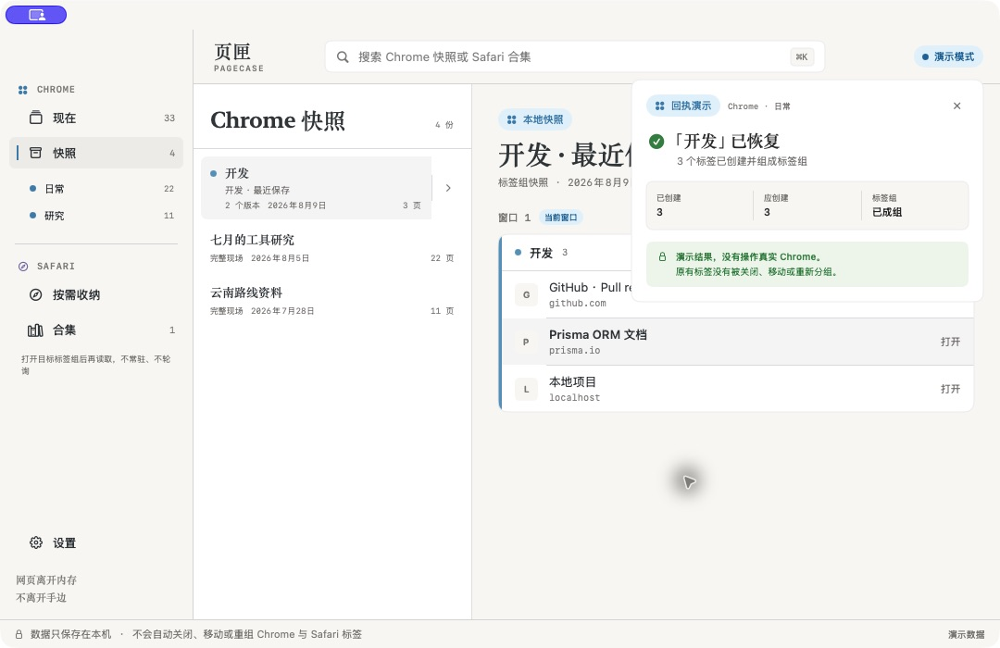

---

## 🔒 Safety Boundaries

> [!IMPORTANT]
> Pagecase never closes, moves, discards, ungroups, or regroups any existing Chrome or Safari tab automatically. The user always performs the closing action that releases memory.

Pagecase explicitly does not:

- Read page content, screenshots, browsing history, bookmarks, downloads, or incognito windows.
- Process `file://`, `chrome://`, extension pages, or other non-Web protocols.
- Sign in, access the network, upload telemetry, or provide accounts, cloud sync, or team collaboration.
- Use Chrome APIs that close, move, discard, or ungroup tabs.
- Restore complete windows or modify an existing tab group.
- Monitor Safari in the background, read Safari's native tab-group name, execute page JavaScript, or read page content.

Every action that changes visible Chrome state starts with a single user click, and group restoration additionally requires reviewing its source, counts, and duplicate-URL notice in a dedicated preview. See the [product specification](docs/PRODUCT.md) and [restore-group architecture decision](docs/adr/0002-restore-groups-with-new-tabs-only.md) for the complete boundary.

---

## Architecture

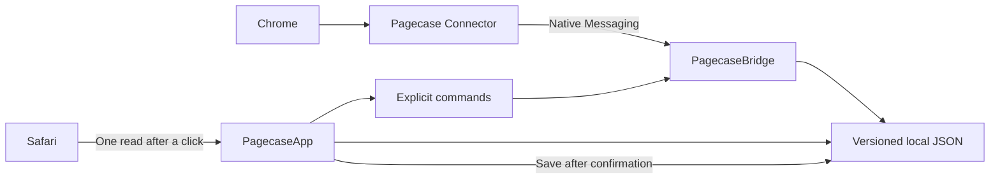

| Component | Responsibility |
|---|---|
| `PagecaseApp` | Native SwiftUI/AppKit interface, search, snapshots, on-demand Safari capture, settings, and menu bar entry |
| `PagecaseCore` | Data models, validation, atomic JSON storage, coverage evaluation, and command models |
| `PagecaseBridge` | Chrome Native Messaging protocol, live-state persistence, and command forwarding |
| `extension/` | Queries regular Chrome windows and tab groups and executes strictly allowlisted commands |

The running app has no third-party dependency and starts no local HTTP service.

---

## Local Data

Production data is stored by default in:

```text
~/Library/Application Support/Pagecase/
├── live/
├── snapshots/
├── chrome-restored-groups.json
├── preferences.json
└── ChromeExtension/
```

Chrome snapshots and Safari collections share the `snapshots/` directory, while every JSON file persists its browser kind and source label so the app can keep them separate. Settings can export the complete library or browser-specific Chrome and Safari files; a scoped export never includes the other browser. Files contain full URLs that may include sensitive query parameters; treat copies and exports as browsing data.

Before importing, Pagecase validates the complete file and opens a read-only preview. Chrome snapshots and Safari collections appear as separate selectable rows with record, page, group, and identifier-conflict counts. Canceling writes nothing, and conflicts are imported as new copies instead of replacing local data.

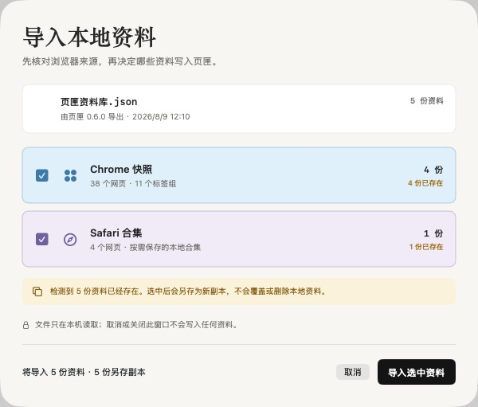

---

## 🧪 Development and Validation

Start the app with isolated demo data and no real Chrome connection:

```bash
PAGECASE_DEMO=1 \
PAGECASE_DATA_ROOT="$(mktemp -d)/pagecase" \
"dist/页匣.app/Contents/MacOS/PagecaseApp" --demo
```

Run the complete automated checks:

```bash
swift build
swift test --enable-swift-testing --disable-xctest
swift run PagecaseCoreChecks
npm run check:extension
npm run test:extension
npm run test:bridge
./scripts/validate-extension.sh
npm run check:safari
./scripts/build-app.sh
```

The repository includes a [GitHub Actions quality workflow](.github/workflows/quality.yml). Pushes to `main`, pull requests, and manual runs execute the same Swift, extension, Safari-boundary, Release, and Bridge checks on a standard `macos-15` runner. The workflow has read-only repository access, uploads no build artifacts, and never connects to a real Chrome or Safari session.

The current Pagecase 0.7.0 source has passed 111 Swift core behavior checks, 13 extension tests, the structured Bridge result round trip, static safety checks for both the Chrome extension and Safari capture, Release builds, light/dark visual acceptance, and the 500-page performance run. The Chrome manual-close checklist only provides verification and location; it never closes a tab.

> [!NOTE]
> A Command Line Tools-only environment cannot enumerate Swift Testing tests correctly. `swift test` still compiles the test package, while `PagecaseCoreChecks` executes the same critical behavior checks.

---

## 📚 Documentation

| Document | Contents |
|---|---|
| [Product specification](docs/PRODUCT.md) | Product goals, scope, critical workflows, and failure scenarios |
| [Technical architecture](docs/ARCHITECTURE.md) | Component boundaries, data protocols, storage, and safety constraints |
| [Visual design](docs/VISUAL-DESIGN.md) | Native macOS interface rules and interaction details |
| [Validation plan](docs/VALIDATION.md) | Automated, static safety, visual, and performance requirements |
| [Validation results](docs/VALIDATION-RESULTS.md) | Current acceptance evidence and remaining unverified items |
| [ADR 0001](docs/adr/0001-native-app-with-read-only-chrome-bridge.md) | Native app and Chrome bridge architecture decision |
| [ADR 0002](docs/adr/0002-restore-groups-with-new-tabs-only.md) | Safety decision to restore groups with newly created tabs only |

---

## 🤝 Contributing

The project favors small, atomic commits and verifiable changes. Before submitting a change, run the relevant Swift or Node tests. Any change to extension commands must also run `./scripts/validate-extension.sh`.

```bash
git clone https://github.com/zaynzhu/Pagecase.git
cd Pagecase
swift build
swift run PagecaseCoreChecks
npm run test:extension
```

Commit messages use the `type: Chinese description` format, for example `feat: 添加快照筛选` or `fix: 修复来源状态判断`.
