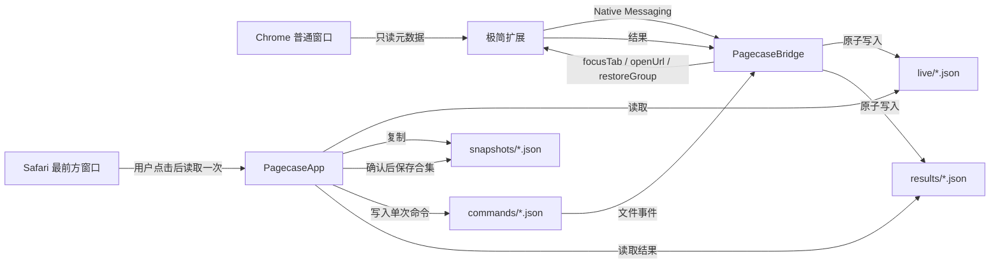

# 页匣 · Pagecase 0.6 技术设计

## 1. 架构结论

当前架构采用三个可独立测试的组件，并把 Safari 按需捕获保持在原生应用进程内：

1. `PagecaseApp`：SwiftUI/AppKit 原生 macOS 应用。
2. `PagecaseBridge`：Swift 编写的 Chrome Native Messaging Host。
3. `extension`：Manifest V3 Chrome 扩展。

应用负责界面、搜索、本地文件与 Safari 单次捕获；扩展负责查询 Chrome 元数据和执行三种明确动作；Bridge 负责可靠地转发 Chrome 消息并原子落盘。Safari 不需要扩展、Bridge 或后台辅助进程。

不使用 Electron、WebView、本地 HTTP 服务、云端服务或第三方依赖。



## 2. 为什么不是纯应用或纯扩展

纯 macOS 应用可以通过 AppleScript读取窗口和标签，但无法可靠获取 Chrome 原生标签组的名称、颜色、折叠状态和实时事件。使用辅助功能读取界面容易随 Chrome 更新失效。

纯扩展可以访问标签组，但界面与数据生命周期被限制在 Chrome 内，无法提供独立菜单栏、原生全局搜索和长期本地资料库。

混合方案让扩展保持极小，把长期数据和视觉复杂度放在低内存原生应用中。

Safari 采用不同取舍：AppleScript 可以按需读取最前方窗口的标签标题、网址和顺序，但不提供可靠的原生标签组名称。Pagecase 因此只在用户点击时执行一次读取，让用户自行命名合集；不为追求“实时”引入 Safari 扩展、辅助功能常驻监测或完整 Xcode 工程。

## 3. 项目结构

```text
pagecase/
├── Package.swift
├── Sources/
│   ├── PagecaseCore/
│   ├── PagecaseApp/
│   └── PagecaseBridge/
├── Tests/
│   └── PagecaseCoreTests/
├── extension/
│   ├── manifest.json
│   ├── background.js
│   ├── commands.js
│   ├── snapshot.js
│   ├── README.txt
│   └── tests/
├── Resources/
│   ├── Info.plist
│   └── generate-icon.swift
├── scripts/
│   ├── build-app.sh
│   ├── check-bridge.mjs
│   ├── install-native-host.sh
│   ├── uninstall-native-host.sh
│   └── validate-extension.sh
└── docs/
```

## 4. 运行环境

- macOS 14 或更高版本。
- Swift 6，Swift Package Manager。
- Chrome Manifest V3。
- Safari 自动化使用系统自带 Apple Events，仅在用户点击时执行。
- Node 22 仅用于扩展测试，不作为运行时依赖。
- 本机没有完整 Xcode，所有必需构建命令必须在 Command Line Tools 环境可运行。

`scripts/build-app.sh` 负责：

1. 执行 Release Swift 构建。
2. 创建 `dist/页匣.app` 标准目录。
3. 放置应用主程序、Bridge、Info.plist 和图标。
4. 将扩展运行文件与离线说明放入 `Contents/Resources/ChromeExtension`。
5. 使用本地 ad-hoc 签名生成可启动产物。

当前版本不声称已完成公证或正式 Developer ID 签名。

## 5. 数据目录

默认目录：

```text
~/Library/Application Support/Pagecase/
├── live/
│   └── <sourceId>.json
├── snapshots/
│   └── <snapshotId>.json
├── commands/
├── processing/
├── results/
├── ChromeExtension/
└── preferences.json
```

测试通过 `PAGECASE_DATA_ROOT` 指向临时目录，不接触真实用户数据。

所有 JSON 写入遵循：

1. 在同一目录创建唯一临时文件。
2. 完整编码并同步写入。
3. 使用原子替换覆盖目标。
4. 写入失败时删除临时文件，保留旧目标。

快照保存后会立刻重新解码并比较磁盘字节，只有结构校验与内容核对都通过，界面才显示保存成功。

资料库导入额外采用目录级事务：

1. 完整解码并校验所有快照、窗口、标签组、网页上下文与网址协议。
2. 在同一数据根目录生成完整暂存资料库并重新读取核对。
3. 将原快照目录移动为临时备份，再用暂存目录替换。
4. 替换失败时恢复原目录；成功后清理备份。

## 6. 数据模型

### 6.1 实时现场

```json
{
  "schemaVersion": 1,
  "source": {
    "id": "uuid",
    "kind": "chrome",
    "label": "Chrome",
    "capturedAt": "2026-08-06T12:00:00Z"
  },
  "windows": [
    {
      "id": 101,
      "order": 0,
      "focused": true,
      "groups": [],
      "ungroupedTabs": []
    }
  ]
}
```

标签组字段：

- `id`：Chrome 运行时标识。
- `title`：允许空字符串，界面显示“未命名标签组”。
- `color`：Chrome 原生颜色枚举。
- `collapsed`：折叠状态。
- `order`：按组内首个标签的索引计算。
- `tabs`：按 Chrome `index` 排序。

网页项字段：

- `id`、`windowId`、`groupId`、`index`
- `title`、`url`
- `pinned`、`active`、`audible`、`discarded`

### 6.2 快照

快照在实时现场外增加：

- `id`
- `name`
- `createdAt`
- `sourceId`
- `sourceKind`：`chrome` 或 `safari`
- `sourceLabel`：持久保存的可读来源名称
- `scope`：`fullState`、`group` 或 `collection`

快照内容不可被实时更新覆盖。重命名只改变快照名称和 `updatedAt`，不改变其网页内容。

`fullState` 保存一个 Chrome 来源当时的全部窗口；`group` 必须且只能包含一个 Chrome 窗口中的一个标签组，不能带未分组网页。`collection` 必须来自 Safari，且只能包含一个窗口、零个标签组和至少一个未分组网页。旧文件缺少浏览器来源字段时按 Chrome 解码，新写入文件始终显式保存来源和范围。

浏览器来源是数据边界，不是展示时临时推断的标签：

- Chrome 快照只参与同一 Chrome 来源的保存覆盖判断。
- 只有 Chrome 标签组快照进入版本序列。
- Safari 合集不参与 Chrome 覆盖、恢复整组或版本收纳。
- 全局搜索可以同时返回两类记录，但结果携带 `sourceKind`，动作由来源决定。

### 6.3 资料库导出

导出文件包含：

- `schemaVersion`
- `exportedAt`
- `applicationVersion`
- `snapshots`
- 不包含实时现场、命令、结果和本地来源连接状态

`SnapshotRepository.exportLibrary` 接受可选 `browserKind`。未指定时导出完整资料库；指定 Chrome 或 Safari 时，在构建 `LibraryExport` 前按持久化的 `sourceKind` 过滤。过滤发生在领域层，界面不能通过隐藏行来伪造浏览器专属备份。

导入分成两个明确阶段：

1. `inspectLibraryImport` 完整解码并验证导出文件，在不写磁盘的前提下按 `sourceKind` 汇总 Chrome、Safari 数量和本地标识冲突。
2. 用户在原生预览面板选择来源并确认后，`importLibrary(browserKinds:)` 才在领域层过滤记录，并复用暂存目录、读回校验与目录级替换完成原子写入。

取消预览、空来源选择和无效文件都不能触发资料目录替换；标识冲突继续生成新标识，不覆盖原记录。

### 6.4 Safari 按需捕获

`SystemSafariCapturer` 实现应用内的 `SafariCapturing` 协议：

1. 用户点击后先确认 Safari 正在运行。
2. 使用 `NSAppleScript` 向 Safari 查询最前方窗口的标签数量、每页标题、网址和当前标签。
3. 只接收 `http/https`，过滤结果记录为一个内存中的 `SafariCapture` 预览。
4. 用户命名确认后，`SafariCollectionBuilder` 转换为 `SavedSnapshot`，经统一模型校验与原子仓库保存。

捕获器不由计时器、目录监听或应用启动触发，不读取 Safari 原生标签组名称，不执行网页内 JavaScript，也没有关闭、移动或修改标签的语句。演示模式注入 `DemoSafariCapturer`，因此自动化和视觉验收不会触发 Apple Events 权限或读取真实 Safari。

## 7. 扩展设计

### 7.1 权限

只申请：

- `tabs`
- `tabGroups`
- `storage`
- `nativeMessaging`

不申请浏览历史、书签、下载、网页正文、全站 host 权限或无痕访问。

### 7.2 捕获

扩展启动后生成并永久保存一个随机 `sourceId`。以下事件经 400ms 防抖后重新生成完整现场：

- 标签创建、更新、移动、附加、分离、关闭
- 窗口创建、关闭、焦点变化
- 标签组创建、更新、移动、关闭

Native Messaging 连接存活时每 20 秒发送一次只读现场心跳，使应用能够区分“Chrome 空闲”与“连接已经失效”。心跳不调用任何 Chrome 写 API。

只接受普通窗口和 `http/https` 网页。捕获逻辑必须是纯函数，可在 Node 中使用模拟数据测试。

### 7.3 允许动作

动作采用严格白名单：

- `focusTab`：先聚焦指定窗口，再激活指定标签。
- `openUrl`：在发出命令的同一 Chrome 用户配置中创建一个普通标签。
- `restoreGroup`：校验全部网址后按顺序创建后台标签，只组合本次命令返回的标签标识，再设置快照中的组名和颜色。

禁止存在以下调用：

- `chrome.tabs.remove`
- `chrome.tabs.move`
- `chrome.tabs.discard`
- `chrome.tabs.ungroup`
- `chrome.windows.remove`
- 任何自动触发的写操作

`chrome.tabs.update` 只允许 `{ active: true }`，`chrome.windows.update` 只允许 `{ focused: true }`。
`chrome.tabs.group` 与 `chrome.tabGroups.update` 只能存在于 `restoreGroup`，前者的 `tabIds` 必须精确来自该命令刚完成的 `chrome.tabs.create` 返回值。

## 8. Native Messaging 协议

消息使用 Chrome 标准的 4 字节小端长度前缀与 UTF-8 JSON。单条消息上限 4MB。

扩展到 Bridge：

- `snapshot`
- `commandResult`
- `ping`

`commandResult` 保留原有 `id`、`sourceId`、`success` 与 `message`，并可携带结构化恢复字段：

- `action`：回显实际执行的命令类型，应用据此拒绝错配结果。
- `createdTabCount`：已经由 Chrome 确认创建的标签数量。
- `groupCreated`：本次新标签是否已经组成标签组。
- `failureStage`：`validation`、`creatingTabs`、`groupingTabs` 或 `updatingGroup`。

新增字段均为可选，以继续读取旧版 Bridge 已落盘的结果；旧版成功结果仅在命令标识与来源一致后推断为完整成功，结果一旦携带 `action` 就必须与原命令匹配。

Bridge 到扩展：

- `focusTab`
- `openUrl`
- `restoreGroup`
- `pong`

Bridge 连接后持续运行：

1. 后台读取标准输入并处理快照或结果。
2. 串行写标准输出，避免消息交错。
3. 监听 `commands/` 目录。
4. 只领取与自身 `sourceId` 匹配的命令。
5. 将命令原子移动至 `processing/` 后发送。
6. 收到结果后写入 `results/` 并清理处理中命令。

应用等待 `focusTab` 与 `openUrl` 结果最多 3 秒，等待可能创建多个标签的 `restoreGroup` 最多 30 秒。待处理恢复项保留完整命令，不只保存截止时间，便于结果到达后校验来源、动作和应创建数量。超时只显示回执，不自动重试可能产生副作用的 `openUrl` 或 `restoreGroup`。

### 8.1 首次连接准备

`ExtensionPackageManager` 将应用包内的五个扩展文件复制到
`Application Support/Pagecase/ChromeExtension`：

1. 先检查内置文件完整。
2. 复制到同一数据目录下的临时文件夹并逐文件比较字节。
3. 使用目录替换发布；失败时恢复原扩展文件夹。
4. 只有用户点击“显示扩展文件”才执行，不会打开 Chrome。

`NativeHostManager` 负责 Host 清单：

- 扩展标识必须精确匹配 32 位 `a-p` 字符。
- 清单只允许一个 `chrome-extension://<id>/` 来源。
- Bridge 路径必须指向当前 `.app` 内的可执行文件。
- 写入后重新解码核对，并设置为 `0644`。
- 应用移动后路径不一致会显示“需要重新配置”，不会静默使用旧路径。
- 配置与移除都只由用户单次点击触发。

## 9. 应用状态管理

`PagecaseCore` 提供：

- `Codable` 领域模型
- 原子 JSON 存储
- 快照仓库
- 快照覆盖核对
- 导入、导出与版本校验
- 搜索规范化与结果排序
- 命令文件创建与结果读取

`PagecaseApp` 使用 `@MainActor` 的单一 `AppModel`，并由一个唯一主窗口与原生
`MenuBarExtra` 共享：

- 每 2 秒检查实时现场目录签名；签名未变化时不重新读取或解码。
- 来源新鲜度统一使用 30 秒边界；只有从“已连接”跨到“数据过期”时才发布界面更新。
- 资料库变更由应用自身立即刷新。
- 菜单展开时刷新本地资料；打开窗口前强制刷新，不向 Chrome 发送命令。
- 搜索聚焦请求保存在模型中并只消费一次，主窗口尚未创建时也不会丢失。
- 主窗口使用固定场景标识，菜单重复打开不会制造多个窗口实例。
- `SnapshotCoverageEvaluator` 在内存中比较同来源实时现场与快照；使用完整网址、
  重复次数、标签组显示名称和颜色作为保守匹配键。
- 完整现场状态只比较 `fullState` 快照；单个标签组状态同时比较 `fullState` 与 `group`
  快照，防止一份标签组快照被误报为整个 Chrome 现场已经保存。
- 分组覆盖结果保留实际命中的快照、窗口和标签组标识，使“查看快照”可以精确打开
  对应版本并滚动到组标题。
- Chrome 实时页用同一分组覆盖结果在内存中计算“全部 / 需保存 / 已收纳”；筛选只构造当前视图需要的窗口与标签组数组，不写偏好、不改模型，也不发送浏览器命令。
- `GroupRestorePreviewBuilder` 只在用户点击 Chrome“恢复整组”时运行；它只选择标识匹配且 `kind = chrome` 的实时来源，以完整网址和重复次数计算当前已打开数量，不读取 Safari 合集，也不改变将发送的完整网址列表。
- `GroupRestoreReceiptBuilder` 只处理 `restoreGroup`：完整创建且成组为成功，已创建任意标签或已成组但后续失败为部分完成，零副作用错误为失败，30 秒无结果为超时。回执不发起清理或重试；Safari 导航与 Safari 专属搜索只隐藏 Chrome 回执，不销毁其状态。
- `AppNotice.browserKind` 为浏览器专属操作记录来源；`nil` 只用于资料读取、完整导入导出和设置等跨浏览器反馈。`RootView` 根据当前导航来源或 `SearchBrowserFilter` 决定是否显示提示，隐藏时不销毁状态，因此返回同一浏览器后仍可核对结果。
- 未分组网页没有标签组覆盖语义，只在“全部”显示；搜索产生标签组查看请求时，实时页先恢复“全部”再消费锚点，避免目标被本地筛选遮挡。
- `SnapshotLibraryOrganizer` 只在内存中构建标签组版本序列；不修改 schema v1、快照文件或搜索索引。
- 导航模型把 Chrome 的“现在/快照”和 Safari 的“按需收纳/合集”作为独立页面；资料库列表先按 `sourceKind` 过滤，再执行选择、删除和回落。
- Safari 捕获只保存在一次用户动作产生的内存预览中，清除、失败或保存成功后不会启动任何持续同步。
- 标签组快照只有在来源、窗口标识、标签组标识、显示名称和颜色全部一致时才进入同一序列；网页数量和网址允许随版本变化。
- 完整现场快照和无法确认单组语境的资料始终作为独立条目。序列按最新版时间排序，序列内快照按创建时间倒序。
- 删除序列中的选中版本时，应用优先选择同序列剩余版本；底层仓库仍只删除一个明确的快照文件。
- 覆盖判断忽略 Chrome 运行时窗口、标签和标签组标识，以及活动、声音和丢弃等易变状态。
  候选优先选择未覆盖网页最少的快照，数量相同时选择创建时间较晚者。
- 搜索在内存中执行；当前版本按 2,000 个网页项设计，不引入数据库。
- 大列表使用懒加载容器；单个分组首次只建立 40 行视图，搜索首次只建立 50 行视图，其余结果按需分批显示。
- 搜索结果保留一个显式选中标识；上下键可跨 50 项批次继续移动，并自动滚动到选中项。
- 搜索结果以 `target = page | group` 区分网页与标签组；标签组结果保留来源、快照、窗口、标签组标识和网页数量，不伪造网址。
- 每条搜索结果同时携带 `sourceKind`；Chrome 和 Safari 可以一起检索，但 UI 必须显示浏览器图标与文字，执行动作时禁止跨来源降级。
- `SearchEngine` 接受 `SearchBrowserFilter`，在遍历实时来源和快照之前排除非目标浏览器。顶栏、结果筛选和实际结果集合共享同一个模型状态，避免从 Safari 页面进入搜索时仍显示 Safari、结果却混合两种浏览器。
- 标签组查看请求携带 `live:<sourceId>` 或 `snapshot:<snapshotId>` 作用域，只在对应列表消费一次；消费前会持久化展开状态，随后滚动到稳定的组锚点。

## 10. 搜索排序

搜索不去重，排序规则依次为：

1. 标签组名称完整匹配
2. 标签组名称前缀匹配
3. 标签组名称包含匹配
4. 网页标题前缀匹配
5. 网页标题包含匹配
6. 网页所属标签组或快照名称匹配
7. 域名匹配
8. 完整网址匹配
9. 实时项优先于快照项
10. 同类结果按捕获时间或快照时间倒序

规范化使用大小写与变音符号不敏感比较，不修改原始显示文本。

## 11. 安全不变量

以下不变量同时通过代码审查、静态扫描和自动化测试验证：

1. 捕获实时现场不会调用任何 Chrome 写 API。
2. 保存快照只复制本地数据。
3. 实时更新永远不会改写快照文件。
4. Chrome 写动作只能由用户界面单次点击产生，且来源必须仍在 30 秒新鲜度窗口内。
5. 写动作只有定位已有标签、创建一个标签，以及经确认后用新建标签恢复一个分组。
6. 无痕窗口和非 Web 协议不会进入本地文件。
7. 应用、Bridge 和扩展没有外部网络请求。
8. 开发与视觉验收不会加载扩展或连接真实 Chrome。
9. 应用不会自动写入 Host 清单；隔离验收通过 `PAGECASE_NATIVE_HOST_ROOT` 改写目标目录。
10. Safari 捕获只能由“读取当前窗口”按钮触发一次，不存在轮询、后台辅助进程或自动重试。
11. Safari 脚本只读取标题、网址、标签顺序和当前页，不包含关闭、移动、网页脚本执行或内容读取。
12. Chrome 快照和 Safari 合集的来源字段必须与各自范围一致，不能互相参与覆盖判断、标签组版本序列或浏览器专属动作。
13. Chrome 或 Safari 专属搜索与专属导出都必须在领域数据集合上过滤，输出中不能出现另一浏览器来源。
14. 导入预览必须只读；浏览器选择必须在领域层过滤，取消、空选择和任一无效记录都不能产生部分写入。
15. Chrome 恢复结果必须校验命令、来源与动作；部分完成或超时不得触发自动回滚、清理或重试，Safari 页面不得呈现 Chrome 回执。

## 12. 可演进边界

未来可以在不破坏 schema v1 的前提下增加 SQLite 搜索索引或其他浏览器适配器，但当前版本不为这些能力预建抽象。只有真实使用证明 JSON 搜索或单浏览器边界不足时再演进。
