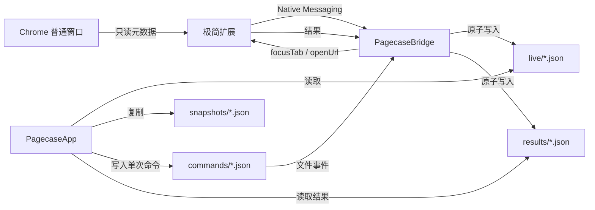

# 页匣 · Pagecase 第一版技术设计

## 1. 架构结论

第一版采用三个可独立测试的组件：

1. `PagecaseApp`：SwiftUI/AppKit 原生 macOS 应用。
2. `PagecaseBridge`：Swift 编写的 Chrome Native Messaging Host。
3. `extension`：Manifest V3 Chrome 扩展。

应用负责界面、搜索、快照和本地文件；扩展负责查询 Chrome 元数据和执行两种明确动作；Bridge 负责可靠地转发消息并原子落盘。

不使用 Electron、WebView、本地 HTTP 服务、云端服务或第三方依赖。



## 2. 为什么不是纯应用或纯扩展

纯 macOS 应用可以通过 AppleScript读取窗口和标签，但无法可靠获取 Chrome 原生标签组的名称、颜色、折叠状态和实时事件。使用辅助功能读取界面容易随 Chrome 更新失效。

纯扩展可以访问标签组，但界面与数据生命周期被限制在 Chrome 内，无法提供独立菜单栏、原生全局搜索和长期本地资料库。

混合方案让扩展保持极小，把长期数据和视觉复杂度放在低内存原生应用中。

## 3. 项目结构

```text
pagecase/
├── Package.swift
├── Sources/
│   ├── PagecaseCore/
│   ├── PagecaseApp/
│   └── PagecaseBridge/
├── Tests/
│   └── PagecaseCoreTests/
├── extension/
│   ├── manifest.json
│   ├── background.js
│   ├── commands.js
│   ├── snapshot.js
│   ├── README.txt
│   └── tests/
├── Fixtures/
├── Resources/
│   └── Info.plist
├── scripts/
│   ├── build-app.sh
│   ├── install-native-host.sh
│   └── uninstall-native-host.sh
└── docs/
```

## 4. 运行环境

- macOS 14 或更高版本。
- Swift 6，Swift Package Manager。
- Chrome Manifest V3。
- Node 22 仅用于扩展测试，不作为运行时依赖。
- 本机没有完整 Xcode，所有必需构建命令必须在 Command Line Tools 环境可运行。

`scripts/build-app.sh` 负责：

1. 执行 Release Swift 构建。
2. 创建 `dist/页匣.app` 标准目录。
3. 放置应用主程序、Bridge、Info.plist 和图标。
4. 将扩展运行文件与离线说明放入 `Contents/Resources/ChromeExtension`。
5. 使用本地 ad-hoc 签名生成可启动产物。

第一版不声称已完成公证或正式 Developer ID 签名。

## 5. 数据目录

默认目录：

```text
~/Library/Application Support/Pagecase/
├── live/
│   └── <sourceId>.json
├── snapshots/
│   └── <snapshotId>.json
├── commands/
├── processing/
├── results/
├── ChromeExtension/
└── preferences.json
```

测试通过 `PAGECASE_DATA_ROOT` 指向临时目录，不接触真实用户数据。

所有 JSON 写入遵循：

1. 在同一目录创建唯一临时文件。
2. 完整编码并同步写入。
3. 使用原子替换覆盖目标。
4. 写入失败时删除临时文件，保留旧目标。

快照保存后会立刻重新解码并比较磁盘字节，只有结构校验与内容核对都通过，界面才显示保存成功。

资料库导入额外采用目录级事务：

1. 完整解码并校验所有快照、窗口、标签组、网页上下文与网址协议。
2. 在同一数据根目录生成完整暂存资料库并重新读取核对。
3. 将原快照目录移动为临时备份，再用暂存目录替换。
4. 替换失败时恢复原目录；成功后清理备份。

## 6. 数据模型

### 6.1 实时现场

```json
{
  "schemaVersion": 1,
  "source": {
    "id": "uuid",
    "kind": "chrome",
    "label": "Chrome",
    "capturedAt": "2026-08-06T12:00:00Z"
  },
  "windows": [
    {
      "id": 101,
      "order": 0,
      "focused": true,
      "groups": [],
      "ungroupedTabs": []
    }
  ]
}
```

标签组字段：

- `id`：Chrome 运行时标识。
- `title`：允许空字符串，界面显示“未命名标签组”。
- `color`：Chrome 原生颜色枚举。
- `collapsed`：折叠状态。
- `order`：按组内首个标签的索引计算。
- `tabs`：按 Chrome `index` 排序。

网页项字段：

- `id`、`windowId`、`groupId`、`index`
- `title`、`url`
- `pinned`、`active`、`audible`、`discarded`

### 6.2 快照

快照在实时现场外增加：

- `id`
- `name`
- `createdAt`
- `sourceId`

快照内容不可被实时更新覆盖。重命名只改变快照名称和 `updatedAt`，不改变其网页内容。

### 6.3 资料库导出

导出文件包含：

- `schemaVersion`
- `exportedAt`
- `applicationVersion`
- `snapshots`
- 不包含实时现场、命令、结果和本地来源连接状态

## 7. 扩展设计

### 7.1 权限

只申请：

- `tabs`
- `tabGroups`
- `storage`
- `nativeMessaging`

不申请浏览历史、书签、下载、网页正文、全站 host 权限或无痕访问。

### 7.2 捕获

扩展启动后生成并永久保存一个随机 `sourceId`。以下事件经 400ms 防抖后重新生成完整现场：

- 标签创建、更新、移动、附加、分离、关闭
- 窗口创建、关闭、焦点变化
- 标签组创建、更新、移动、关闭

Native Messaging 连接存活时每 20 秒发送一次只读现场心跳，使应用能够区分“Chrome 空闲”与“连接已经失效”。心跳不调用任何 Chrome 写 API。

只接受普通窗口和 `http/https` 网页。捕获逻辑必须是纯函数，可在 Node 中使用模拟数据测试。

### 7.3 允许动作

动作采用严格白名单：

- `focusTab`：先聚焦指定窗口，再激活指定标签。
- `openUrl`：在发出命令的同一 Chrome 用户配置中创建一个普通标签。

禁止存在以下调用：

- `chrome.tabs.remove`
- `chrome.tabs.move`
- `chrome.tabs.discard`
- `chrome.tabs.group`
- `chrome.tabs.ungroup`
- `chrome.windows.remove`
- `chrome.tabGroups.update`
- 任何自动触发的写操作

`chrome.tabs.update` 只允许 `{ active: true }`，`chrome.windows.update` 只允许 `{ focused: true }`。

## 8. Native Messaging 协议

消息使用 Chrome 标准的 4 字节小端长度前缀与 UTF-8 JSON。单条消息上限 4MB。

扩展到 Bridge：

- `snapshot`
- `commandResult`
- `ping`

Bridge 到扩展：

- `focusTab`
- `openUrl`
- `pong`

Bridge 连接后持续运行：

1. 后台读取标准输入并处理快照或结果。
2. 串行写标准输出，避免消息交错。
3. 监听 `commands/` 目录。
4. 只领取与自身 `sourceId` 匹配的命令。
5. 将命令原子移动至 `processing/` 后发送。
6. 收到结果后写入 `results/` 并清理处理中命令。

应用等待命令结果最多 3 秒。超时只显示失败，不重试可能产生副作用的 `openUrl`。

### 8.1 首次连接准备

`ExtensionPackageManager` 将应用包内的五个扩展文件复制到
`Application Support/Pagecase/ChromeExtension`：

1. 先检查内置文件完整。
2. 复制到同一数据目录下的临时文件夹并逐文件比较字节。
3. 使用目录替换发布；失败时恢复原扩展文件夹。
4. 只有用户点击“显示扩展文件”才执行，不会打开 Chrome。

`NativeHostManager` 负责 Host 清单：

- 扩展标识必须精确匹配 32 位 `a-p` 字符。
- 清单只允许一个 `chrome-extension://<id>/` 来源。
- Bridge 路径必须指向当前 `.app` 内的可执行文件。
- 写入后重新解码核对，并设置为 `0644`。
- 应用移动后路径不一致会显示“需要重新配置”，不会静默使用旧路径。
- 配置与移除都只由用户单次点击触发。

## 9. 应用状态管理

`PagecaseCore` 提供：

- `Codable` 领域模型
- 原子 JSON 存储
- 快照仓库
- 导入、导出与版本校验
- 搜索规范化与结果排序
- 命令文件创建与结果读取

`PagecaseApp` 使用 `@MainActor` 的单一 `AppModel`，并由一个唯一主窗口与原生
`MenuBarExtra` 共享：

- 每 2 秒检查实时现场目录签名；签名未变化时不重新读取或解码。
- 来源新鲜度统一使用 30 秒边界；只有从“已连接”跨到“数据过期”时才发布界面更新。
- 资料库变更由应用自身立即刷新。
- 菜单展开时刷新本地资料；打开窗口前强制刷新，不向 Chrome 发送命令。
- 搜索聚焦请求保存在模型中并只消费一次，主窗口尚未创建时也不会丢失。
- 主窗口使用固定场景标识，菜单重复打开不会制造多个窗口实例。
- 搜索在内存中执行；第一版按 2,000 个网页项设计，不引入数据库。
- 大列表使用懒加载容器；单个分组首次只建立 40 行视图，搜索首次只建立 50 行视图，其余结果按需分批显示。
- 搜索结果保留一个显式选中标识；上下键可跨 50 项批次继续移动，并自动滚动到选中项。

## 10. 搜索排序

搜索不去重，排序规则依次为：

1. 完整标题前缀匹配
2. 标题包含
3. 标签组或快照名称匹配
4. 域名匹配
5. 完整网址匹配
6. 实时项优先于快照项
7. 同类结果按最近捕获或快照时间倒序

规范化使用大小写与变音符号不敏感比较，不修改原始显示文本。

## 11. 安全不变量

以下不变量同时通过代码审查、静态扫描和自动化测试验证：

1. 捕获实时现场不会调用任何 Chrome 写 API。
2. 保存快照只复制本地数据。
3. 实时更新永远不会改写快照文件。
4. Chrome 写动作只能由用户界面单次点击产生，且来源必须仍在 30 秒新鲜度窗口内。
5. 写动作只有定位已有标签和创建一个标签。
6. 无痕窗口和非 Web 协议不会进入本地文件。
7. 应用、Bridge 和扩展没有外部网络请求。
8. 开发与视觉验收不会加载扩展或连接真实 Chrome。
9. 应用不会自动写入 Host 清单；隔离验收通过 `PAGECASE_NATIVE_HOST_ROOT` 改写目标目录。

## 12. 第一版可演进边界

未来可以在不破坏 schema v1 的前提下增加 SQLite 搜索索引、整组恢复或其他浏览器适配器，但第一版不为这些能力预建抽象。只有真实使用证明 JSON 搜索或单浏览器边界不足时再演进。
